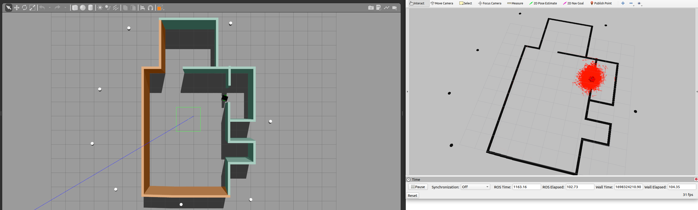

# Robotics Software Engineer Nanodegree - Where Am I?

## Overview

This repository is part of the Udacity Robotics Software Engineer Nanodegree program. The project focuses on creating a robot and its Gazebo environment using ROS Kinetic. The robot is defined using XML (Xacro), and two ROS nodes are implemented:

1. **Drive Control Node:** This node creates a service server that publishes drive commands to control the movement of the robot. It provides a service interface to command the robot to move forward, backward, or rotate.

2. **Ball Tracker Node:** The second node subscribes to the camera feed and utilizes computer vision techniques to detect a white ball in the robot's environment. When the white ball is detected, the node sends a request to the service provided by the Drive Control Node, instructing the robot to move towards the ball.

3. **AMCL Node:** This node is used to localize robot using amcl  

## Prerequisites

- ROS Kinetic/Melodic/Noetic
- Gazebo
- 
  ``sudo apt-get install ros-${ROS_DISTRO}-navigation``

## Project Structure

- `urdf/`: Contains the robot description in Xacro format.
- `launch/`: ROS launch files for launching the Gazebo environment and the robot nodes.
- `scripts/`: ROS nodes implementation.
- `worlds/`: Gazebo world file defining the simulation environment.
- `CMakeLists.txt` and `package.xml`: ROS package configuration files.

## How to Use

1. Clone and build this repository to your local machine:

   ```bash
   cd catkin_ws/src
   git clone https://github.com/Y-Hegazi/go-chase-it.git
   cd ..
   catkin_make
   source devel/setup.bash
   ```
2. Launch nodes:
   ```bash
   roslaunch my_robot world.launch 
   ```
   ```bash
   roslaunch ball_chaser ball_chaser.launch #You dont need it for localization
   ```
     ```bash
   roslaunch my_robot amcl.launch #localization
   ```
   To test the robot you need to move any ball inside robot's environment.


## Localization 




## Notes

- This project is part of the Udacity Robotics Software Engineer Nanodegree. For more details on the program, visit [Udacity Robotics Software Engineer Nanodegree](https://www.udacity.com/course/robotics-software-engineer--nd209).

## License

This project is licensed under the MIT License. See the [LICENSE](LICENSE) file for details.
